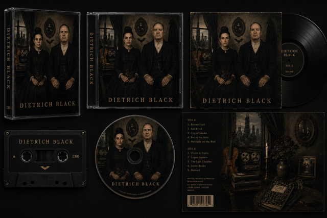
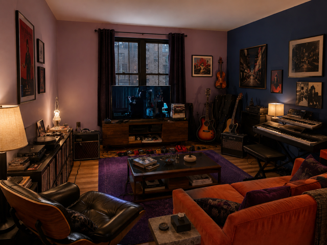
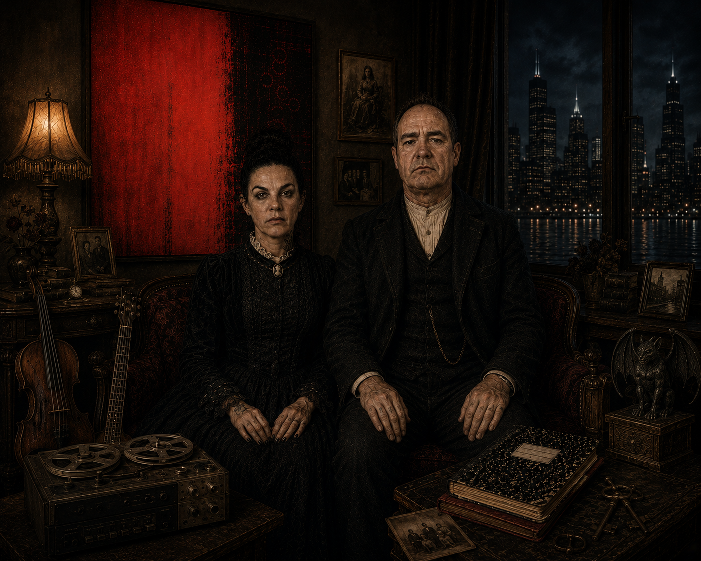

# The Dietrich Files

> *"Some stories are written in ink. Others are written in blood."*

A full-stack web application showcasing the world of Dietrich Black through artwork, stories, music, and interactive experiences.



***Dedicated to the world of Dietrich Black.***

---

## Welcome

There are worlds that exist only in memory, whispered from one generation to the next. Others are born from canvas, music, and the written word until they become something greater than imagination alone.

**The Dietrich Files** is one such world.

This application serves as a living archive of the vampire **Dietrich Black**—a place where artwork, stories, music, and mythology converge to preserve an ever-expanding gothic universe. Every illustration, every tale, and every melody represents another thread woven into a narrative decades in the making.

Whether you have wandered here by chance or returned seeking another chapter, welcome. The files await.

---

## Features

*"Every artifact tells a story."*

### Current

* [ ] React frontend
* [ ] Express backend
* [ ] MongoDB database
* [ ] Responsive design

### Planned

* [ ] Artwork Gallery
* [ ] Story Archive
* [ ] Music Collection
* [ ] Character Lore
* [ ] Search & Filtering
* [ ] Contact Portal
* [ ] Community Features
* [ ] Authentication
* [ ] Admin Dashboard

---

## Technology

### Frontend

* React
* React Router
* Vite

### Backend

* Node.js
* Express
* MongoDB
* Mongoose

---

## Project Structure


```text
the-dietrich-files
│
├── client/
├── server/
├── README.md
└── .gitignore
```

---

## Gallery

*Screenshots Coming Soon*






---

## Roadmap


### Phase I

* [ ] Establish the foundations
* [ ] React application
* [ ] Express server
* [ ] MongoDB integration

### Phase II

* [ ] Gallery
* [ ] Stories
* [ ] Music Archive

### Phase III

* [ ] Artwork Management
* [ ] Dynamic Content
* [ ] Search

### Phase IV

* [ ] Community Features
* [ ] Contact Portal
* [ ] User Interaction

### Phase V

* [ ] Authentication
* [ ] Deployment
* [ ] Continuous Expansion

---
## Author

**Kendra Anne Hartnett**

Github: [@kendrahartnett](https://github.com/kendrahartnett)

--- 

## Acknowledgements

*"Some worlds are imagined. Others are lived."*

This project is dedicated to **Robert Mimms**—artist, author, visionary, and the original creator of **The Dietrich Files** and the vampire **Dietrich Black**.

Long before this application existed, Robert devoted years to bringing Dietrich's world to life through his artwork, music, and unwavering imagination. His creative vision laid the foundation for a universe that continues to grow beyond the page and the canvas.

Together, as partners in life and co-creators of this ever-evolving world, we continue to shape its mythology, preserve its history, and imagine what still waits in the darkness. This application is our archive—a place where art, literature, music, and fantasy exist together in their purest form.

May every visitor discover something that lingers with them long after they leave these pages.

And may **Dietrich Black** live on forever.

---

> *"The archive is still being written."*